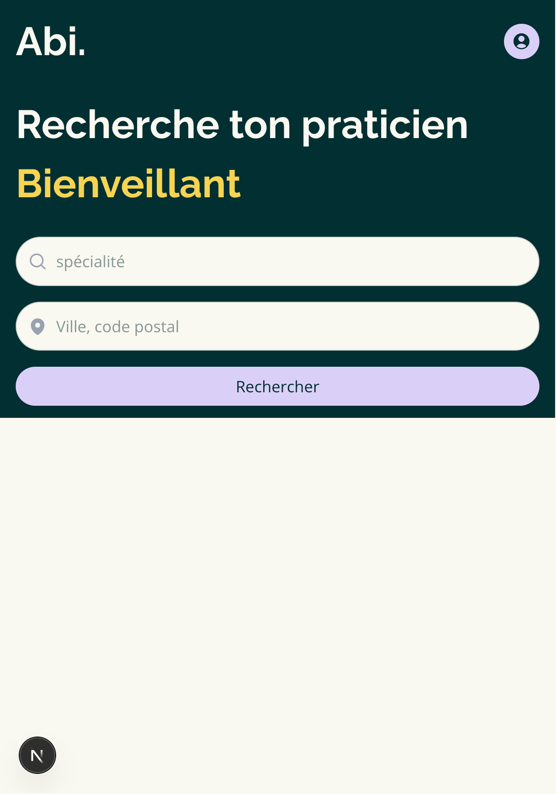
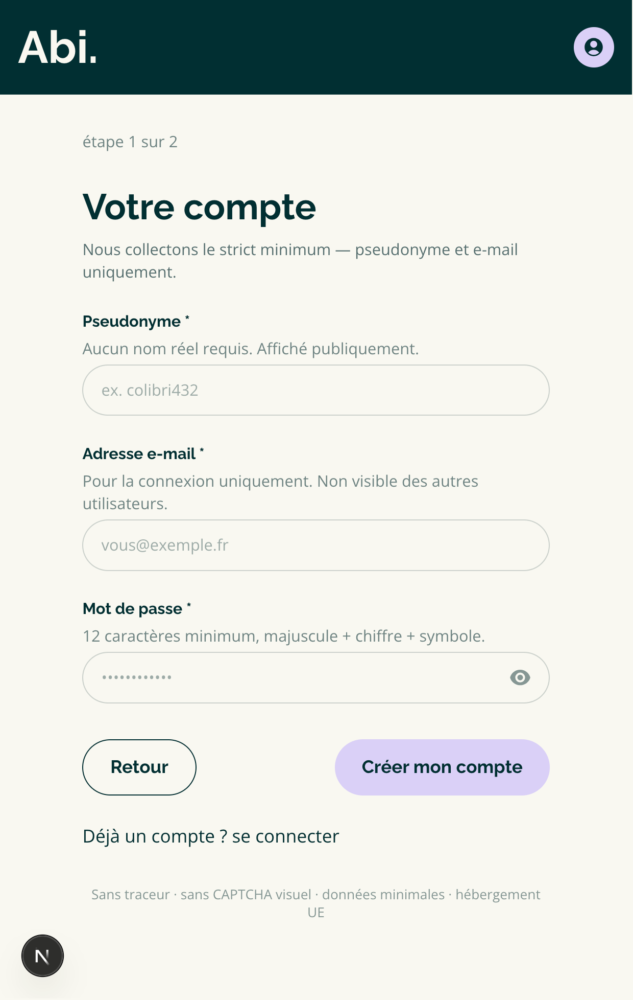

Abi — Application Bienveillante et Inclusive

Annuaire de spécialistes de santé bienveillants, inclusifs et éthiques, recommandés et badgés de confiance par des associations de patients et les patients eux-même.

Statut : en développement actif — Demo Day prévu le 2 juin 2026 · Soutenance RNCP6 mi-août 2026

🎯 Le problème
Trouver un professionnel de santé compétent ne suffit pas pour les personnes en situation de vulnérabilité (maladies chroniques, handicap, publics LGBTQIA+, personnes racisées, femmes…). Il n'existe pas d'annuaire structuré autour de critères éthiques validés par des associations de terrain.
Abi comble ce vide : les praticiens sont référencés et recommandés par des associations partenaires sur des critères transparents (consentement éclairé, inclusivité, accessibilité), puis publiés après validation de l'administrateur.

✨ Fonctionnalités
MVP (en cours)

Page d'accueil avec recherche par spécialité et localisation
Schémas de base de données (Drizzle ORM)
Authentification multi-rôles (BetterAuth) — routes signin/signup
UI des formulaires d'inscription (en cours)
Fiches praticiens avec floutage partiel pour non-connectés
Workflow de contribution : patient propose → validation par l'administrateur → publication
Seed de démonstration (praticiens, tags, utilisateurs fictifs)

**Scope V1 : parcours Patient uniquement.** Le sélecteur de rôle à l'inscription
affiche toujours l'option Association (elle fait partie du pitch produit — « praticiens
validés par des associations de patients »), mais elle est désactivée (grisée, badge
« Bientôt disponible », non sélectionnable) et refusée côté serveur si on tente de
contourner l'UI. Raison : construire ce parcours en entier (formulaire de profil
association, workflow de validation `pending/active/suspended`, interface de modération)
est un chantier à part entière, disproportionné pour le temps restant avant la
soutenance. L'architecture est prête (tables `associations` et
`practitionerAssociations` dans `server/db/schema/app.ts`) pour une implémentation V2.

Post-MVP (V2)

Parcours d'inscription Association complet (formulaire de profil, validation par un administrateur)
Tableau de bord association (modération, validation)
Interface d'administration
Cartographie des praticiens
Système d'avis patients

**Note technique V2 — rôle admin (BetterAuth)** : le plugin `admin()` de BetterAuth (`lib/auth/config.ts`) réutilise la colonne `role` de la table `users` pour distinguer les administrateurs (valeur par défaut `"admin"`), la même colonne que celle utilisée par l'app pour `"patient"`/`"association"` (`lib/validations/role.ts`). Le nom du champ n'est pas configurable côté plugin (vérifié dans `admin.d.mts` — seules les *valeurs* `defaultRole`/`adminRoles` le sont), mais il est protégé en écriture côté formulaire public (`input: false` dans le schéma du plugin — un utilisateur ne peut pas se l'auto-attribuer via l'inscription). Avant de créer le premier compte admin, prévoir :
- Configurer explicitement `admin({ adminRoles: ["admin"] })`
- Étendre `roleSchema` (`lib/validations/role.ts`) pour inclure `"admin"` comme valeur reconnue
- Ajouter le cas `role === "admin"` dans le routing (`app/dashboard/page.tsx` ou une future page `/admin`), qui aujourd'hui tomberait silencieusement sur `redirect("/")`

🛠️ Stack technique:

Framework: Next.js 16 => (App Router)SSR natif, routing file-based,
Langage: TypeScript => Typage strict, maintenabilité.
Base de données: PostgreSQL (Neon) => Relationnel, serverless-compatible
ORM: Drizzle => Type-safe, léger, migrations versionnées
Auth: BetterAuth => Multi-rôles natif, sessions sécurisées
Styling: Tailwind CSSv4 => Mobile-first, tokens CSS personnalisés
Déploiement: Vercel => CI/CD intégré, preview par PR
Tests: Vitest => Unit + intégration
CI/CD: GitHub Actions => Lint, tests, déploiement automatisé

🏗️ Architecture

Le projet suit une architecture en couches stricte (BC02) : chaque couche a une responsabilité unique et ne dépend jamais d'une couche au-dessus d'elle.

```
app/                          ← Couche présentation — routes Next.js
├── api/auth/[...all]/        # BetterAuth handlers
├── dashboard/                # Dashboard selon le rôle (patient / asso)
├── practitioners/[id]/       # Fiche praticien détaillée
├── search/                   # Résultats de recherche
├── signin/ & signup/         # Authentification

components/                   ← Couche présentation — composants React
├── layout/                   # Header, HeaderAuth, UserMenu
├── home/                     # Hero (page d'accueil)
├── practitioners/            # PractitionerCard, SearchCombobox
├── auth/                     # SignInForm, SignUpRoleSelector, SignupCredentials
├── dashboard/
│   ├── patient/              # PatientView
│   └── association/          # AssociationView
└── common/                   # Button, AuthGateModal (réutilisables partout)

lib/                          ← Couche configuration & validation
├── auth/
│   ├── config.ts             # Configuration BetterAuth (server-only)
│   └── client.ts             # authClient (navigateur)
├── privacy.ts                 # Masquage des données praticien pour les non-connectés
└── validations/               # Schémas Zod — source unique de vérité pour la validation ET le typage
    ├── auth.ts                # credentialsSchema, signinSchema
    ├── role.ts                # roleSchema + type Role ("patient" | "association"), réutilisé partout
    ├── savedPractitioners.ts  # savedPractitionerSchema
    └── utils.ts                # formatZodErrors (formatte les erreurs Zod pour l'UI)

server/                       ← Couche accès aux données (server-only)
├── db/
│   ├── index.ts              # Connexion Drizzle → Neon
│   └── schema/
│       ├── app.ts            # Tables métier (practitioners, tags, associations…)
│       └── auth.ts           # Tables BetterAuth (users, sessions…)
├── auth/
│   └── getCurrentUser.ts     # Seul point qui parle à BetterAuth + next/headers pour la session
├── queries/
│   ├── practitioners.ts      # Requêtes DB : search, detail, suggestions
│   ├── savedPractitioners.ts # Requêtes DB : praticiens sauvegardés par un patient
│   └── users.ts              # Requêtes DB : mise à jour du rôle utilisateur
└── actions/
    ├── auth.ts                # Server Action : setUserRole
    ├── savePractitioner.ts    # Server Action : sauvegarder un praticien
    └── unsavePractitioner.ts  # Server Action : retirer un praticien sauvegardé
```

Règle de dépendance :
- `components/` ne sait pas que la base de données existe
- `server/queries/` ne sait pas que des composants React existent
- `lib/` contient uniquement de la config et de la validation, sans accès DB direct
- `server/actions/` ne connaît jamais BetterAuth ni `next/headers` directement : chaque Server Action appelle `server/auth/getCurrentUser.ts`, seul point du projet couplé au provider d'authentification. Si BetterAuth est remplacé un jour, seul ce fichier change — les actions restent intactes.
- Les valeurs métier à choix limité (ex. le rôle utilisateur) sont définies une seule fois comme schéma Zod dans `lib/validations/`, jamais retapées en type TS local dans plusieurs fichiers (voir section Zod ci-dessous).

## 🗄️ Base de données

Schéma défini avec Drizzle ORM dans `server/db/schema/` (`app.ts` : tables métier · `auth.ts` : tables BetterAuth), migrations versionnées dans `drizzle/`.

**Tables actives (MVP)**

| Table | Rôle |
|---|---|
| `practitioners` | Fiche praticien — statut de modération (`pending/validated/rejected/suspended`), visibilité, praticien proposé/validé par (`proposedBy`/`validatedBy`, alimenté par seed en MVP) |
| `tags`, `practitionerTags` | Tags catégorisés attachés aux praticiens (accessibilité, inclusivité…) — contenu curé en MVP |
| `savedPractitioners` | Praticiens sauvegardés par un patient (lecture + écriture complètes) |
| `users`, `sessions`, `accounts`, `verifications` | Auth (BetterAuth) |

**Tables modélisées, V2 assumée** — présentes dans le schéma pour documenter des fonctionnalités prévues mais volontairement non branchées avant la soutenance, pour ne pas livrer de parcours inachevé :

| Table | Fonctionnalité prévue |
|---|---|
| `associations`, `practitionerAssociations` | Une association recommande/badge un praticien qu'elle connaît (confiance patient) et suit ces praticiens dans son dashboard — la publication reste décidée par l'administrateur |
| `tagVotes` | Vote patient sur les tags d'un praticien — classement par nombre de votes (le classement affiché en MVP vient du seed, pas encore de votes réels) |
| `reports` | Signalement d'une fiche praticien/association erronée ou d'un problème éthique — modération humaine uniquement, jamais d'action automatique (masquage, blacklist), pour limiter le risque légal (diffamation, responsabilité de plateforme) |
| `practitionerConsentRequests`, `consentLogs` | Demande de consentement RGPD envoyée au praticien avant publication de sa fiche (`practitioners.isVisible`) — process manuel (email) en MVP, ces tables modélisent l'automatisation future (lien à usage unique, traçabilité IP/version CGU) |

## 🧩 Zod dans le projet

Zod (v4) a deux rôles dans Abi, qui se recoupent :

1. **Validation à l'exécution** — vérifier qu'une donnée reçue (formulaire, argument de Server Action) respecte bien les règles métier avant d'aller plus loin (ex. `credentialsSchema` impose 12 caractères minimum + majuscule + chiffre + symbole pour un mot de passe).
2. **Source unique de vérité pour le typage TypeScript** — au lieu de définir un type à la main (`type Role = "patient" | "association"`) puis un schéma Zod séparé qui répète la même liste de valeurs, on ne définit le schéma qu'une fois et on en déduit le type avec `z.infer` :

   ```ts
   // lib/validations/role.ts
   export const roleSchema = z.enum(["patient", "association"]);
   export type Role = z.infer<typeof roleSchema>;
   ```

   Tout le reste du projet (`server/queries/users.ts`, `server/actions/auth.ts`, `SignUpRoleSelector.tsx`, `SignupCredentials.tsx`, `app/signup/page.tsx`) importe ce type `Role` au lieu d'en retaper un — un seul endroit à modifier si un rôle est ajouté un jour, et TypeScript signale partout où un cas manquerait d'être traité.

Schémas actuels :

| Schéma | Fichier | Utilisé par |
|---|---|---|
| `credentialsSchema`, `signinSchema` | `lib/validations/auth.ts` | Formulaires signin/signup (validation client + serveur) |
| `roleSchema` | `lib/validations/role.ts` | `setUserRole`, `updateUserRole`, sélecteur de rôle à l'inscription |
| `savedPractitionerSchema` | `lib/validations/savedPractitioners.ts` | `savePractitioner`, `unsavePractitioner` |

**Règle** : toute donnée qui entre dans une Server Action (venant du client, donc non fiable) est validée par un schéma Zod avant d'être utilisée — jamais de confiance aveugle dans un type TS côté client, qui ne protège qu'à la compilation et pas à l'exécution.

⚠️ Note DB : les valeurs comme `role` restent stockées en `text` libre côté PostgreSQL (colonne gérée par BetterAuth) — Zod garantit la cohérence côté application, mais n'empêche pas une valeur invalide d'être insérée par un autre chemin que le code TS (script, admin SQL direct). Un `pgEnum` Drizzle apporterait une garantie supplémentaire au niveau base si besoin.

🔐 Sécurité & conformité

RGPD art. 9 : données de santé — collecte minimale (pseudonyme + email uniquement), consentement explicite recueilli à l'inscription, droit à la suppression exposé dans l'interface
Hébergement UE : Neon (Frankfurt) + Vercel (Edge)
Authentification : sessions httpOnly, CSRF protection, rate limiting (BetterAuth)
Anti-bot : Cloudflare Turnstile (sans CAPTCHA visuel — accessible)
Mots de passe : 12 caractères minimum, complexité imposée côté client (Zod) et serveur
OWASP : validation entrées, pas d'exposition de données sensibles aux non-connectés (floutage praticiens)

♿ Accessibilité
Conformité RGAA (déclinaison française WCAG 2.1) — exigence explicite RNCP37873 :

Landmarks HTML5 sémantiques (<header>, <main>, <nav>)
Contrastes vérifiés AAA : #002F33 / #F9F8F1 → 13.56:1 · #F7D452 / #002F33 → 9.97:1
aria-label sur tous les boutons icône · aria-hidden sur icônes décoratives
Focus visible sur tous les éléments interactifs (RGAA 10.7)
Touch targets ≥ 44×44px (WCAG 2.5.5)
Pas de CAPTCHA visuel (Turnstile invisible)

## ⚙️ CI/CD

Le workflow `.github/workflows/pr.yml` valide le code avant merge : lint (ESLint), typecheck (`tsc --noEmit`), build (`next build`), tests (Vitest).

**Déclenchement** :
- Automatique à l'ouverture ou la mise à jour d'une Pull Request vers `main`
- Manuel via `workflow_dispatch` — utile pour vérifier l'état d'une branche (ex. `develop`) sans ouvrir de PR :
  - Interface GitHub : onglet **Actions** → "PR Validation" → bouton **Run workflow** → choisir la branche
  - CLI : `gh workflow run pr.yml --ref <branche>`

Il n'y a volontairement pas de déclenchement sur `push` direct (hors PR) pour éviter de multiplier les runs sur des commits intermédiaires — la CI manuelle (`workflow_dispatch`) couvre ce besoin ponctuel en cours de dev.

**Secrets requis** (Settings → Secrets and variables → Actions du repo GitHub), mêmes clés que `.env` local sans les guillemets :

| Secret | Rôle |
|---|---|
| `DATABASE_URL` | Connexion Neon — nécessaire car `server/db/index.ts` instancie le client au chargement du module, importé transitivement par la route `/api/auth/[...all]` que Next.js analyse au build |
| `RESEND_API_KEY` | Instanciation du client Resend dans `lib/auth/config.ts` |
| `BETTER_AUTH_SECRET` | Lu en interne par `betterAuth()` |
| `BETTER_AUTH_URL` | Lu en interne par `betterAuth()` |
| `NEXT_PUBLIC_APP_URL` | Utilisée par `authClient` dans `lib/auth/client.ts` |

Ces valeurs ne déclenchent aucun appel réseau réel pendant le build (`neon()` et `betterAuth()` sont instanciés de façon paresseuse) — une valeur syntaxiquement correcte suffit, y compris `http://localhost:3000` pour les URLs.

## 📱 Screenshots

| Home — Mobile                       | Home — Desktop                          | Signup |
| ----------------------------------- | --------------------------------------- | ------ |
|  |  |

🚀 Installation locale
bash# Prérequis : Node.js 20+, compte Neon, compte BetterAuth

git clone https://github.com/[ton-username]/abi
cd abi
pnpm install

# Variables d'environnement

cp .env.example .env.local

# → Renseigner DATABASE_URL, BETTER_AUTH_SECRET, BETTER_AUTH_URL

# Migrations

pnpm drizzle-kit push

# Démarrer

pnpm run dev

🗺️ Roadmap
Semaine 1-2 (mai 2026) ✅ Setup, Home UI, Auth routes, Schemas Drizzle
Semaine 3-4 (mai 2026) 🔄 Auth UI, seed, fiches praticiens (floutage)
Semaine 5-6 (juin 2026) ⏳ Demo Day MVP — recherche fonctionnelle
Semaine 7-12 (juin-août) ⏳ Tests, déploiement, documentation

V2 (hors soutenance) Parcours d'inscription association complet, dashboard association, admin

🎓 Contexte académique
Projet de soutenance Titre Pro CDA RNCP6 — RNCP37873 couvrant les blocs :

BC01 : interfaces utilisateur, composants métier, sécurité applicative
BC02 : architecture multicouche, modélisation BDD, accès aux données
BC03 : tests, déploiement, démarche DevOps
